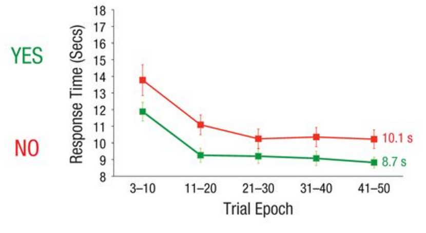

```{r setup, include=FALSE}
knitr::opts_chunk$set(echo = TRUE)
library(dplyr)
library(ggplot2)
library(lsr)
library(lme4)
```

##Introduction
In their paper “Object Persistence Enhances Spatial Navigation”, Liverence & Scholl test their theory that persistent object representation could “serve as underlying units of longer-term memory and active spatial navigation”. To test this, Liverence & Scholl used a “novel paradigm inspired by the visual interfaces common to many smartphones”. In the experiment, the participants use key presses to navigate through a simple visual environment consisting of a grid of icons. Liverence & Scholl limited the view of the grid to one object at a time via a static window. The researchers found that participants found target icons faster when navigation involved persistence cues (via sliding animations) than when persistence was disrupted (e.g., via temporally matched fading animations). In addition, the researchers found that the difference between the two transition methods “occurred even after explicit memorization of the relevant information”, which led them to the conclusion that “object persistence enhances spatial navigation in an automatic and irresistible fashion.”

More specifically, three different pairs of animation types were tested to attempt to isolate the specific effects of object persistence and motion. The pairs of animations used by the researchers in the experiments were a) slide vs. fade, b) slide vs. wipe and c). fade then slide vs. slide then fade. A fourth experiment, which tested grid memory, was performed to probe the effects of explicit memory as the experiment went on. This was done as the experimenters found that the participants had essentially memorized the grid by the end of each block of experiments. For the purposes of replication, just the first experiment was be replicated.

##Methods

###Power Analysis
The key statistic that will represent the success of this replication is the fact that Liverence and Scholl noticed that participants were faster in all trials when slide animation versus the fade animation (1.41s difference, t(17) = 5.22, d = 1.23, p < .001, post-hoc power = .92). 

There are some supplementary statistics that we will attempt to also replicate. Liverence and Scholl noticed that spatial learning occurred over the 50 trials in a block, noticing a 3.31s difference between the average trial RTs in the first and last epochs (bins of 10 trials) in a block. They also noticed that RTs were still lower for the slide condition in each epoch up to the fifth, even when trial speed had plateaued (all p < .001). The fifth epoch averages also differed by an average of 1.46s (t(17) = 4.08, p < .001, d = 0.96). 

###Planned Sample
The sample size for each of the experiments will be 19 individuals, which is based on the sample size that Liverence and Scholl used. An extra participant was added to the Liverence and Scholl's number, to account for potential incomplete data and technical issues that may come from using Mechanical Turk. No preselection rules will be applied to the sample.

###Materials
Responses to the experiment are done using a keyboard and mouse, the keyboard being the primary tool of interaction on a per trial basis. The stimuli will be presented on the user’s own monitor, in contrast to Liverence and Scholl’s study, which used a "standardized CRT monitor subtending 44.6° × 36.3°. Responses will be made using the keyboard and mouse. In contrast to the original experiment, which used MATLAB and the PsychToolbox libraries, this particular replication will use custom software written in Javascript and HTML in order to adapt the experiment to the web. Users will be suggested to do the experiment in full screen to mimic the original study; in fact they will be forced to make the experiment stage full screen at the beginning of the experiment (but can enter/re-enter fullscreen at any time). Icons used as stimuli are drawn from the same set of that of Liverence and Scholl's experiment; they can be found at: http://cvcl.mit.edu/MM/uniqueObjects.html.

###Procedure

**Experiment Mockup Viewable at:** http://stanford.edu/~jedtan/jedtanProject/project/persistence_experiment.html

Each subject was presented with a 4 x 4 grid of icons, of which only one is viewable. The icons were 32 photos of real-world objects, which are obtained from the same image set that Liverence and Scholl used. Sixteen unique icons were used each of two blocks. Each subject performs two blocks of fifty trials. Each block will have a different transition, counterbalanced between participants. For example, half the subjects first block will have all slide animations, and their second will have all fade animations. The second half of subjects blocks will proceed as all fade animations for the first block, and all slide animations for the second block. The main viewable square icon has a side dimension of 150 pixels and is presented at the center of the display inside a white square window (presented on a black background). Each icon is also surrounded by a 2 pixel black border. Participants press four keys (for “up,” “down,” “left,” and “right”) to navigate through each 4 × 4 virtual environment. Upon each key press, the current icon in the static window is replaced with the new corresponding icon (via a 400-ms animation during which no other key presses are possible). The grid was functionally bounded (e.g., so that a “right” key press has no effect if the current icon was from the right-most virtual column). On slide-transition trials, outgoing and incoming icons moved smoothly in the direction opposite the key press through an animation lasting 400 ms. On fade-transition trials, the current icon faded gradually to white over 167 ms; a blank white window was then displayed for 66 ms, and then the new icon gradually faded in from white over 167 ms (for a total of 400 ms). On each trial, four target icons were displayed beneath the window (Fig. 1b), and participants had to locate and navigate to them in the order in which they were displayed (from left to right). The order and identity of the target icons for each trial were randomly generated once and stored offline, and these trials were then presented in a randomized order for each participant. After a correct click, a green border (4 pixels) appeared around the image of the target icon, each of which was a square icon of side dimension 100 pixels. Out-of-order (i.e., incorrect) clicks were not registered. A brief break screen is presented between each block.

Before engaging in the two blocks of trials, users are presented with a tutorial, in which they navigate two different paths with only two icon paths in each. For each of these paths, they traverse the path in the same manner as above in order to get themselves acquainted with the experiment setup. This tutorial portion uses another separate grid of 16 icons from the same data set; none of the icons in the tutorial are however shared with the two blocks of fifty trials.

Upon finishing the two blocks of trials, users are asked to input basic demographics including ethnicity, age and gender. Each of these questions can be opted-out of.

### Analysis Plan

The data collected and analyzed during this experiment (at least for the first three experiments) consists of participant response times for the task given (traverse the grid in order of the icons given to them). Following Liverence and Scholl, “The initial two trials of each block [will not be] analyzed, as pilot testing suggested that participants typically made an especially large number of key presses during those initial trials (a pattern consistent with subjective reports of a period of free exploration). In addition, trials with response times (RTs) longer than 30 s (0.56% of the remaining trials) will be excluded.”

The key statistic, as mentioned earlier in the Power Analysis section, is the average time difference between trials in the slide and fade condition. A t-test will be run on the data set, in addition to calculating cohen's D in order to estimate if we see similar results between this replication and the original study.

Additional supplementary statistics that Liverence and Scholl collect (and I will collect) included statistic difference in mean response times between slide and fade animations in epochs (groups of ten trials). T-tests will be run on the differences in means for each epoch (for example, the difference in mean response time between fade and slide transition trials in trials number 1-10). In addition to the above t-tests, analysis will be done on the rate of spatial learning (decrease in response time from the first to last epoch).

Furthermore, in addition to the above confirmatory statistics, keypress count data collected from the experiment can also be used to explore the rate of spatial learning with regards to number of keypresses (as opposed to decrease in response time). In addition, I will explore the effect of age on response times in addition to attempting to generate a mixed effect linear model to estimate mean response times.

### Differences from Original Study

There should not be major differences between the original and replicated study. While most of the differences have been mentioned previously, they are restated below. 

* **Experiment**: Just the first experiment will be duplicated (fade versus slide animations). Liverence and Scholl’s original paper do three additional experiments in addition to the one described above, wherein they analyze explicit memory (recall from memory of grid after a block) and low-level movements (testing fade-then-slide versus slide-then-fade).
* **Sample**: No age restriction will be done on participants, which means that we cannot know if the sample will mimic the original study participants' 18.9yr mean age.
* **Materials**: As opposed to the Liverence & Scholl experiment, where the actual hardware is standardized, each participant may have slightly different hardware setups. Measurements of icons are based in pixel versus degree measurements In addition, the testing application will be written in JavaScript and HTML, as opposed to Matlab.
* **Procedure**: Slight differences in several measurements for the display (i.e. distance between icons, etc) may exist in the replicated implementation of the software. Of course, the experiments will also no longer be done in person, but instead via mechanical turk. Two blocks of fifty trials will be done instead (one being slide transitions, one being fade transitions), due to funding requirements and to maintain Turker engagement. Another potential difference between the original experiment and this replication are response times. We expect response times to be, in general, higher in the replication due to delays over the internet that we cannot account for. These include but are not limited to delays stemming from images loading on the clients side.
* **Analysis**: No changes from original experiment planned. Further exploratory analysis will be done on the number of key presses.

I do not foresee any differences in results between the original experiment and the replicated experiment. None of the changes have a clear connection with any of the conditions that caused the effects observed by the experimenters.

## Methods Addendum

```{r read_data, echo=FALSE}
rawD <- read.csv("/Users/jedtan/Documents/win2016/psych254/jedtanProject/data_manipulation/final_results.csv")
```

```{r read_dem_data, echo=FALSE}
rawDem <- read.csv("/Users/jedtan/Documents/win2016/psych254/jedtanProject/data_manipulation/final_demographics.csv")
rawDemGenderCounts = rawDem %>% 
  group_by(Gender) %>% 
  summarise(count = n())
```

### Actual Sample
The final experiment sample consisted of 19 individuals, with an average age of `r round(mean(rawDem$Age), digits=2)` (SD = `r round(sd(rawDem$Age), digits=2)`); in constrast with Liverence and Scholl's mean age of 18.9. A histogram and bar chart of participants' age and ethnicity respectively are shown below. `r rawDemGenderCounts$count[1]` of the 19 subjects were female (`r round(100 * rawDemGenderCounts$count[1] / 19, digits=2)`%).

```{r demographics_plots}
ggplot(rawDem, aes(Age)) +
  geom_histogram(binwidth = 5) + 
  ylab("Count") +
  labs(title="Age Breakup")

rawDemAgeCounts = rawDem %>% 
  group_by(Ethnicity) %>% 
  summarise(count = n())
ggplot(rawDemAgeCounts, aes(x=Ethnicity, y=count)) + 
  geom_bar(stat="identity") + 
  ylab("Count") + 
  labs(title= "Ethnicity Breakup")
```

```{r get_number_excluded, echo=FALSE}
excluded <- rawD %>%
  filter(Trial > 2, Time > 30000, Block > 0)
```

With regards to data exclusion, the >30s trial exclusion implemented by Liverence & Scholl resulted in the exclusion of `r nrow(excluded)` trials (`r round(100 * nrow(excluded)/nrow(rawD), digits=2)`%)

### Differences from pre-data collections plan
There were no differences from the pre-data collections plan.


## Results

###Data preparation

The raw data is first modified by adding the epoch number to the frame. Trials with RT >30s along with the first two trials of each block are excluded, per Liverence and Scholl's original procedure. In addition, the transition type is converted to a two level factor variable (replacing the 0/1 values with their appropriate "Slide/Fade" labels).

```{r mutate_data}
d <- rawD %>%
  filter(Time < 30000, Trial > 2, Block > 0) %>% 
  mutate(epoch= floor((Trial-1)/10) + 1, keyPressesOver = KeyPresses-MinKeyPresses) %>% 
  rename(Transition=Stimulus)
d$Transition <- factor(d$Transition, levels=c(0, 1), labels=c("Slide", "Fade"))
d$epoch <- factor(d$epoch)
```

###Confirmatory analysis

```{r generate_key_statistic}
transition_means = d %>% group_by(WorkerID, Transition) %>% summarise(meanTime = mean(Time), meanKeyPressOver = mean(keyPressesOver)) %>% group_by(Transition) %>% summarise(meanTime = mean(meanTime), meanKeyPressOver = mean(meanKeyPressOver))
transition_worker_means = d %>% group_by(WorkerID, Transition, Age) %>% summarise(meanTime = mean(Time), meanKeyPressOver = mean(keyPressesOver))

slide_mean = round(transition_means$meanTime[1]/1000, digits=2)
fade_mean =  round(transition_means$meanTime[2]/1000, digits=2)

full_t.test <- t.test((transition_worker_means %>% filter(Transition == "Fade"))$meanTime, (transition_worker_means %>% filter(Transition == "Slide"))$meanTime, paired=TRUE)

epoch <- d %>% group_by(WorkerID, epoch, Transition) %>% 
  summarise(meanTime = mean(Time), meanPress = mean(KeyPresses))

full_cohensDVal <- cohensD((epoch %>% filter(Transition == "Fade"))$meanTime, (epoch %>% filter(Transition == "Slide"))$meanTime)
```

As a key statistic, Liverence and Scholl report that "Across all trials, participants were on average 1.41 s faster per trial on slide-transition blocks than on fade-transition blocks (9.27 s vs. 10.68 s, a difference of 15.2%), t(17) = 5.22, p< .001, d = 1.23." The same statistics generated over all trials in the new condition found that participants were on average `r fade_mean-slide_mean`s faster per trial on slide-transition blocks than on fade-transition blocks (`r slide_mean`s vs. `r fade_mean`s, a difference of `r ((slide_mean / fade_mean) - 1)*100`%), t(18) = `r full_t.test$statistic`, p= `r full_t.test$p.value`, d=`r full_cohensDVal`. 

```{r overall_improvement, echo=FALSE}
time_differences <- d %>%
  group_by(epoch) %>% 
  summarise(meanTime = mean(Time))
```
To verify the learning undergone by the subjects, we observe that there is a `r round((time_differences$meanTime[1] - time_differences$meanTime[5])/1000, digits = 2)`s improvement in trial speed over the 50 trial block, which is compared to the original figure of 3.31s obtained by Liverence and Scholl.

Continue confirmatory analysis, we first produce a per trial and per epoch comparison in means between the Side and Fade transitions. To do this, we employ the use of dplyr's group_by and summarise functions.

```{r per_trial_and_epoch}
overTrial <- d %>% group_by(Trial, Transition, epoch) %>% 
  summarise(meanTime = t.test(Time)$estimate, timeLow = t.test(Time)$conf.int[1], timeHigh = t.test(Time)$conf.int[2], meanPress = t.test(KeyPresses)$estimate, meanLow = t.test(KeyPresses)$conf.int[1], meanHigh = t.test(KeyPresses)$conf.int[2], meanKeyPressOver = t.test(keyPressesOver)$estimate, overLow = t.test(keyPressesOver)$conf.int[1], overHigh = t.test(keyPressesOver)$conf.int[2])
totalMeans <- d %>% group_by(Transition, epoch) %>% 
  summarise(meanTime = t.test(Time)$estimate, timeLow = t.test(Time)$conf.int[1], timeHigh = t.test(Time)$conf.int[2], meanPress = t.test(KeyPresses)$estimate, meanLow = t.test(KeyPresses)$conf.int[1], meanHigh = t.test(KeyPresses)$conf.int[2], meanKeyPressOver = t.test(keyPressesOver)$estimate, overLow = t.test(keyPressesOver)$conf.int[1], overHigh = t.test(keyPressesOver)$conf.int[2])
```

Liverence and Scholl also claim that, for each epoch, the difference in RT means is different between the two transition conditions with p-values \leq .001. We attempt to replicate these statistics.
``` {r generate_t_statistics}
test_statistics <- data.frame(Epoch=c(1,2,3,4,5)) %>% 
  mutate(Statistic = 0, PValue = 0)

for(i in 1:5)
{
  temp_t.test = t.test((epoch %>% filter(epoch == i, Transition == "Fade"))$meanTime, (epoch %>% filter(epoch == i, Transition == "Slide"))$meanTime, paired=TRUE)
  test_statistics[i, 2] = temp_t.test$statistic
  test_statistics[i, 3] = temp_t.test$p.value
}
test_statistics
```

As we can see from the above data frame, p-values for each the RT differences between transitions for each of the epochs are all \geq .05, which suggests that there is not a statistically significant mean between the transition types at the epoch level.

Below, we plot the per trial and per epoch means between the two transition types.

```{r per_trial_and_epoch_press_graphs}
ggplot(data=totalMeans, aes(x=epoch, y=meanTime, group = Transition, colour = Transition)) +
  geom_line() +
  geom_errorbar(aes(ymin=timeLow, ymax=timeHigh), width=.2) + 
  geom_point( size=2, shape=21, fill="white") + labs(title = "Per Epoch Means") + xlab("Epoch") + ylab("Mean Time (ms)")
```
Here is the original graph comparing per-epoch means as presented by Liverence and Scholl.


```{r per_epoch_graphs}
ggplot(data=overTrial, aes(x=Trial, y=meanTime, group = Transition, colour = Transition)) +
  geom_line() +
  geom_errorbar(aes(ymin=timeLow, ymax=timeHigh), width=.2) + 
  geom_point( size=2, shape=21, fill="white") + labs(title = "Per Trial Means") + xlab("Trial") + ylab("Mean Time (ms)")

```


### Exploratory Analysis
One advantage that the original study has was the ability to choose a very homogenous participant set - having a data set primarily drawn from college students may have reduced variance in mean performance times. I propose that one of the factors that contributed to their strong test statistic was a lack of variance in mean response time between subjects. One particular aspect of the original study's demographic that was alarming was the mean low age (18.79yrs). While the original authors do not report standard deviation of the age in question, the experimental setup (done in a college), suggests perhaps a fairly homogenous group of college aged students (perhaps within the range of 18-22 years old).

As such, a potential introduction of variance in my mean response times that may decrease the power of the key-statistic analysis is age. We explore that here:

```{r age_effects}
all_trial_worker_means = d %>% 
  group_by(WorkerID, Age) %>% 
  summarise(meanTime = mean(Time))
ggplot(all_trial_worker_means, aes(x=Age, y=meanTime)) + 
  geom_point() + 
  geom_smooth()
```

Doing a simple linear model however does not reveal too alarming of a result. This linear model was done with and without the included data from one individual in the sample who had an age of 60, which was definitely an outlier in this case (mean age was `r round(mean(all_trial_worker_means$Age), digits=2)`, SD was `r round(sd(all_trial_worker_means$Age), digits=2)`). When the outlier is removed, the linear model procedes as such. 

```{r age_linear_model}
linModel <- lm(meanTime ~ 1 + Age, data = all_trial_worker_means %>% filter(Age > 55))
linModelAnova <- anova(linModel)
```

As we can see, given a p-value of `r linModelAnova$"Pr(>F)"` we cannot say that age is a significant fixed effect variable.

While the key-statistic replication may not have worked out when following Liverence and Scholl's exact procedure, as part of our exploratory analysis, we can attempt to use a linear mixed model to fit the data. The logic behind using a linear mixed effect model stems from our analysis of individual subjects as a random effect, and trial and condition as having fixed and interacting effects. 

```{r linear_model}
linModel <- lmer(Time ~ 1 + Trial * Transition + (1|WorkerID), data = d)
summary(linModel)
anova(linModel)
```

Interestingly enough, using this linear model, it appears that the fade transition is a significant effect, having a p-value of .0034. This may point to the transition type actualy being a signficant factor. 

We also analyze trends in keypress data per epoch and per trial can also be seen. This include raw keypress counts (for the first two graphs), and keypress over minimum counts for the second two graphs. For example, a keypress over minimum count of 3 meant that the subject pressed three more directional keys than absolutely required to traverse the four element icon path.

```{r per_trial_and_epoch_graphs}
ggplot(data=totalMeans, aes(x=epoch, y=meanPress, group = Transition, colour = Transition)) +
  geom_line() +
  geom_errorbar(aes(ymin=meanLow, ymax=meanHigh), width=.2) + 
  geom_point( size=2, shape=21, fill="white") + 
  labs(title = "Per Epoch Keypress Means") + 
  xlab("Epoch") + 
  ylab("Mean Key Presses")

ggplot(data=overTrial, aes(x=Trial, y=meanPress, group = Transition, colour = Transition)) +
  geom_line() +
  geom_errorbar(aes(ymin=meanLow, ymax=meanHigh), width=.2) + 
  geom_point( size=2, shape=21, fill="white") + 
  labs(title = "Per Trial Keypress Means") + 
  xlab("Trial") + 
  ylab("Mean Key Presses")

ggplot(data=totalMeans, aes(x=epoch, y=meanKeyPressOver, group = Transition, colour = Transition)) +
  geom_line() +
  geom_errorbar(aes(ymin=overLow, ymax=overHigh), width=.2) + 
  geom_point( size=2, shape=21, fill="white") + 
  labs(title = "Per Epoch Keypress Over Minimum Means") + 
  xlab("Epoch") + 
  ylab("Mean Key Presses Over Minimum")

ggplot(data=overTrial, aes(x=Trial, y=meanKeyPressOver, group = Transition, colour = Transition)) +
  geom_line() +
  geom_errorbar(aes(ymin=overLow, ymax=overHigh), width=.2) + 
  geom_point( size=2, shape=21, fill="white") + 
  labs(title = "Per Trial Keypress Over Minimum Means") + 
  xlab("Trial") + 
  ylab("Mean Key Presses Over Minimum")
```

```{r get_keypress_means, echo=FALSE}

full_keypress_t.test <- t.test((transition_worker_means %>% filter(Transition == "Fade"))$meanKeyPressOver, (transition_worker_means %>% filter(Transition == "Slide"))$meanKeyPressOver, paired=TRUE)
```

Interestingly enough, we note the mean key presses  for transition types is different in the opposite manner as that of actual response times - keypress counts are higher for slide transition trials than fade transition trials. Fade transition trials use an average of `r -1*unname(full_keypress_t.test$estimate)` key presses per trial (`r round(transition_means$meanKeyPressOver[1], digits=2)` for fade trials, `r round(transition_means$meanKeyPressOver[2], digits=2)` for slide trials), t(18) = `r full_keypress_t.test$statistic`, p=`r full_keypress_t.test$p.value`. While this is not significantly significant, it does seem to be constant across epochs.

## Discussion

### Summary of Replication Attempt

With the key statistic of average response time difference between slide and fade transitions, we cannot conclude the same primary result as Liverence and Scholl's experiment. However, it seems that this replication could potentially be labeled as a partial replication of Liverence and Scholl's original experiment. Things that hint to this include some of the exploratory statistics in addition to general trends seen in the replicatory analysis.

### Commentary

A major impetus to calling this replication a partial replication of the previous study is the fact that several trends and statistics do align between the original study and replication. Firstly, rate of spatial learning was similar between the two experiments (3.89s vs. 3.31s). In addition, slide transition trial times were on average faster than fade transition trial times (`r fade_mean - slide_mean`s), though not to a statistically significant amount. In addition, mean slide transition response times were faster in each epoch than their fade transition counterpart. The strongest statistical suggestion to the importance of the transition is the linear model, for which the p-value associated with the transition main effect in the linear mixed effects model was statistically signficant (p=.003). Thus, it seems that the main blocker to the power of the original key test-statistic comes from large amounts of variance in mean response times between participants. This suggests that a larger sample size could be a gateway towards replicating Liverence and Scholl's observations.

Other exploratory analysis explored the roles of age. It was not found that age had a significant effect on the mean response times, as verified by a linear model. However, this is not a foregone conclusion - our sample size was simply large or varied enough with regards to age to make concrete conclusions about the effect of age on response time. 

Going in a slightly different direction, keypress analysis yielded some unexpected and interesting results. The most notable fact was that keypress counts evidently trended in the different direction based on transition than response time. While the differences in means was not statistically significant, (just like response time differences), it did seem to persist across epochs. A potential reason for this phenomenon may have to be with how learning proceeds for the different transition types. It may be that slide transitions result in the subject making quicker, coarse judgements about direction that are less precise - meaning faster input but less preciseness in actually following the four icon path. This is speculation but could be a future direction of study.

Rehashing a previously made point, a few small differences between the original and present study may have resulted in the differences between the results. The first is sample selection. Liverence and Scholl saw much smaller variance in their sample size, resulting in a much higher test statistic - the more homogenous nature of their sample population (primarily college-age students) may have resulted in smaller variance in mean response times. A second small difference could be running the replication experiment online via the browser as opposed to a dependable, predictable computer system in a lab. Differences between users, including internet speed and browser cache sizes could introduce more variance into the system. 

In summary, it is safe to say that the same effects that Liverence and Scholl were not explicitly seen in the replication. However, some data points suggest that this replication method could potentially result in the same effect given a larger sample size. In addition, exploratory statistics point to potential future avenues of study.
